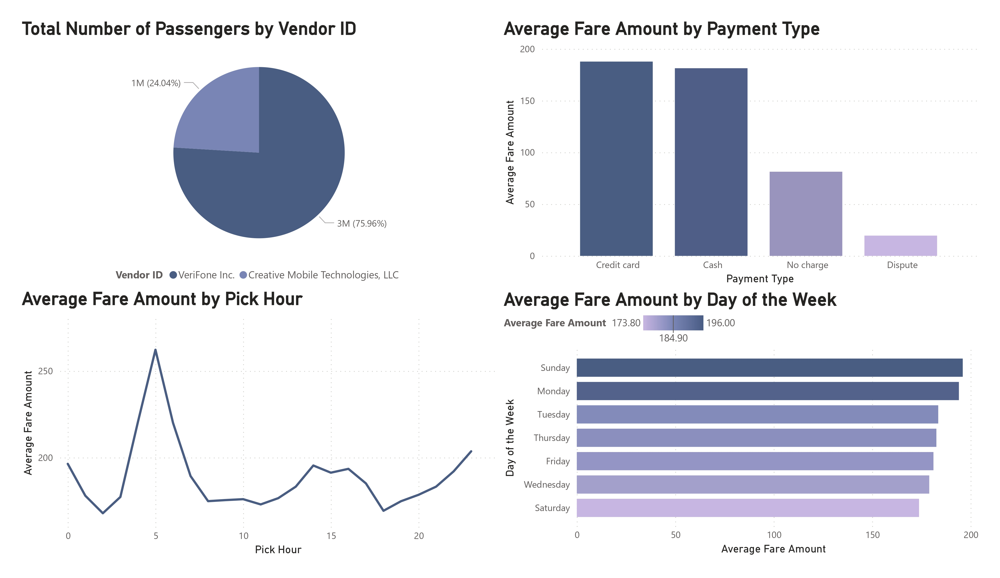

# Data Migration from Snowflake to Microsoft Azure

## Introduction

The goal of this project is to demonstrate the process of migrating data from Snowflake to Azure Data Lake Storage Gen2 using Azure Synapse Analytics, performing data transformation using Azure Databricks, and connecting it to Power BI to create a dashboard.

## Architecture 

## Simple Dashboard

## Technology Used
- Programming Language - Python
- Snowflake

Microsoft Azure :

1. Azure Synapse Analytics
2. Azure Data Lake Storage Gen2 
3. Azure Databricks
4. Power BI

## Dataset Used
TLC Trip Record Data
Yellow and green taxi trip records include fields capturing pick-up and drop-off dates/times, pick-up and drop-off locations, trip distances, itemized fares, rate types, payment types, and driver-reported passenger counts.

More info about dataset can be found here:
1. Website - https://www.nyc.gov/site/tlc/about/tlc-trip-record-data.page
2. Data Dictionary - https://www.nyc.gov/assets/tlc/downloads/pdf/data_dictionary_trip_records_yellow.pdf

## Article About this Project 
Medium Article - https://medium.com/@ahmadkamiludin/migrate-your-data-seamlessly-a-quick-end-to-end-guide-from-snowflake-to-microsoft-azure-for-36b9ce3557d6